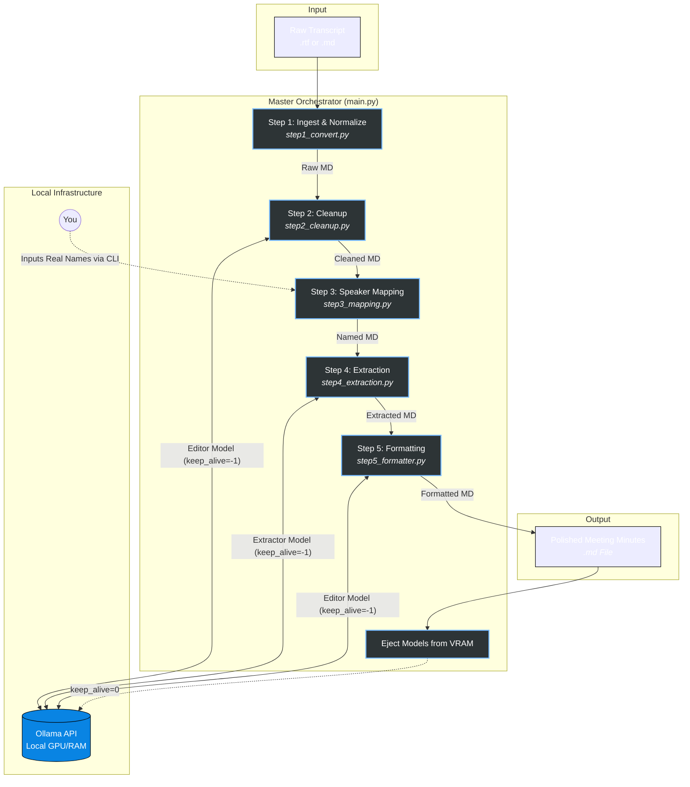

# README

## Description

> [!Note]
A multi-agent, privacy-first pipeline that transforms raw meeting transcripts into polished, corporate-grade meeting minutes using local LLMs (like Gemma4 and Qwen) via Ollama. Accepts `.rtf` exports from [Moonshine.ai](https://note-taker.moonshine.ai/) **and** `.md` exports from our local transcriber — the ingest step auto-detects the format and normalizes both into the same canonical shape before the LLM agents run.

## Overview

Generating high-quality meeting minutes locally from 45+ minute transcripts is challenging. Passing a raw `.rtf` file with a single massive system prompt to a ~27B parameter local model often results in cognitive overload, hallucinated action items, and dropped details. 

**Our Solution:** We break the problem down into a **5-step chained pipeline**. By isolating tasks—cleanup, human-in-the-loop speaker identification, data extraction, and final formatting—we can achieve "Google-level" summary quality using local, consumer-grade hardware while keeping sensitive corporate data 100% private.

---

## Key Learnings & Architecture Decisions

During the development of this pipeline, several critical discoveries shaped the architecture:

1. **RTF Noise vs. Markdown:** Raw RTF tags consume thousands of wasted tokens and confuse LLMs. Stripping the RTF into explicit Markdown (`**Speaker 1:** text`) acts as an anchor, helping the model perfectly distinguish between the speaker and the dialogue.
2. **The "Human-in-the-Loop" Necessity:** LLMs frequently hallucinate action-item ownership if speakers don't explicitly name themselves. A fast, non-LLM CLI prompt to map generic tags (e.g., "Speaker 1") to real names (e.g., "Andro") eliminates this risk entirely.
3. **Extraction vs. Formatting:** Asking an LLM to extract data *and* format it into tables simultaneously leads to data loss. We split this: Agent 2 acts as a "Data Harvester" (extracting exhaustive, categorized bullets), and Agent 3 acts as the "Publisher" (formatting the dense data into clean tables and lists).
4. **Model Nuances (Gemma vs. Qwen):** * **Gemma (~27B)** excels at natural language smoothing and narrative flow but needs strict structural guides.
   * **Qwen (~27B)** is highly logical but tends to over-compress. It requires "negative constraints" (e.g., *CRITICAL INSTRUCTION: DO NOT summarize away technical details*) to ensure high data fidelity.
   * *Solution:* The pipeline uses **Dynamic Prompting**, automatically switching the internal system prompt based on the `--model` argument passed in the CLI.
5. **VRAM Optimization:** We utilize the `keep_alive=-1` parameter in the Ollama API to keep the LLM loaded in VRAM across the sequential scripts, drastically reducing execution time.

---

## Prerequisites

* **Python 3.8+**
* **[uv](https://github.com/astral-sh/uv)** (Python package manager)
  ```bash
  # on a mac it would be, after installing uv
  uv sync
  ```
* **Environment Variables**: You MUST create a `.env` (see [.env.template](.env.template)) file in the root directory containing your Ollama host address. The pipeline will not run without it.
  * **[Ollama](https://ollama.com/)** running locally or on your network (Default expects: `http://<YOUR OLLAMA IP>:<YOUR OLLAMA PORT>`)
* **Local Models:** Pull your preferred models in Ollama:
  
  ```bash
  ollama pull gemma4:26b
  ollama pull qwen3.5:27b
   ```

    > [!Warning] 
    > As of April, 2026, the internal system prompts are tailored to `gemma4:26b` and `qwen3.5:27b`. If using a different model or even same family models with higher or lower weights, you might need to adjust the system prompts via experimentation or develop / tweak affordance of the respective agent scripts. 

## The 5-Step Pipeline Workflow

## Pipeline Architecture



### Step 1: Ingest & Normalize Transcript (Non-LLM)

Dispatches by file suffix:

- `.rtf` → strips Moonshine's RTF formatting and groups consecutive speech.
- `.md` → parses our local transcriber's H3-heading format (with per-turn timestamps and language tags), or passes through an already-canonical markdown file unchanged.

Both paths emit the same canonical Markdown (`**Speaker N:** text`) plus a JSON sidecar with turn stats (_not used in further processing currently_). See [`contexts/multi_format_ingest.md`](contexts/multi_format_ingest.md) for the full spec and design decisions.

```bash
# Moonshine input (.rtf)
uv run python -m pipeline.step1_convert transcripts/<MeetingTranscript>.rtf --out-dir output/raw_files/

# Our local transcriber's input (.md)
uv run python -m pipeline.step1_convert transcripts/<MeetingTranscript>.md --out-dir output/raw_files/
```

### Step 2: Agent 1 - Transcript Cleanup

The LLM acts as a **Data Cleaner**.

It proofreads the raw markdown, removes verbal stutters, false starts, and filler words without summarizing or losing chronological context.

```bash
uv run step2_cleanup.py output/raw_files/<MeetingTranscript>.md --out-dir output/cleaned_files/
```

### Step 3: Speaker Mapping (Human-in-the-Loop)

A quick CLI script that scans for `Speaker X:` tags and pauses to ask you for their real names. 

It then performs a global find-and-replace, ensuring 100% accurate attribution for the subsequent AI steps.

```bash
uv run step3_mapping.py output/cleaned_files/<MeetingTranscript_cleaned>.md --out-dir output/named_files/
```

### Step 4: Agent 2 - Information Extraction

The LLM acts as a **Data Harvester**. 

It scans the named transcript and extracts exhaustive, high-fidelity bullet points, organizing them into logical H3 sub-categories while preserving specific metrics, dates, and brands.

```bash
uv run step4_extraction.py output/named_files/<MeetingTranscript_named>.md --out-dir output/extracted_files/
```

### Step 5: Agent 3 - Final Formatting

The LLM acts as the **Publisher**. 

It takes the dense extraction and formats it into a professional layout, generating a "Participants" list and organizing Action Items into a strict Markdown table `(Task | Owner | Status)`.

```bash
uv run step5_formatter.py output/extracted_files/<MeetingTranscript_extracted>.md --out-dir output/final_summaries/
```

---

## Advanced CLI Usage

All AI agents (`02`, `04`, `05`) support CLI overrides for the model and the host URL. The scripts will automatically detect if you are using a Gemma or Qwen model and apply the optimized system prompt.

> [!Warning] 
> As of April, 2026, the internal system prompts are tailored to `gemma4:26b` and `qwen3.5:27b`. If using a different model or even same family models with higher or lower weights, you might need to adjust the system prompts via experimentation or develop / tweak affordance of the respective agent scripts. 

### The Master Orchestrator (main.py)

Because every step in this pipeline is modular, you do not need to run the individual scripts one by one. You can use the master orchestrator to run the entire pipeline end-to-end. 

It will automatically build the output directories, process the transcript, pause to ask you for speaker names, and then generate the final summary.

```bash
# Run the full pipeline with default models (on a Moonshine RTF)
uv run main.py transcripts/MeetingTranscript.rtf

# Or on our local transcriber's markdown export
uv run main.py transcripts/MeetingTranscript.md

# Run the full pipeline using the Mix-and-Match model strategy
uv run main.py transcripts/MeetingTranscript.rtf \
    --editor-model gemma4:26b \
    --extractor-model qwen3.5:27b
```

### Mixing and Matching Models (The "Best of Both Worlds" Strategy)

Because different LLMs excel at different cognitive tasks, you are not locked into a single model for the entire pipeline. 

For example, Gemma models are historically fantastic at natural language smoothing and narrative flow, making them ideal for formatting. Qwen models are highly logical and obedient to structural constraints, making them perfect for exhaustive data extraction. 

You can leverage this by switching the `--model` argument at each step:

```bash
# Step 2: Use Gemma for natural, grammatical text cleanup
uv run step2_cleanup.py output/raw_files/Meeting.md \
    --out-dir output/cleaned_files/ \
    --model gemma4:26b

# Step 4: Switch to Qwen for rigid, exhaustive data extraction
uv run step4_extraction.py output/named_files/Meeting_named.md \
    --out-dir output/extracted_files/ \
    --model qwen3.5:27b

# Step 5: Switch back to Gemma for polished, corporate document formatting
uv run step5_formatter.py output/extracted_files/Meeting_extracted.md \
    --out-dir output/final_summaries/ \
    --model gemma4:26b
```

### Customizing the Ollama Host

If you are running Ollama on a dedicated home server, a secondary GPU rig, or within a specific Docker network, you can override the default local URL using the `--host` flag:

```bash
uv run step2_cleanup.py input.md --host http://<your_ollama_host_ADDR>:<your_ollama_host_PORT>
```

## Directory Structure

```txt
.
├── main.py
├── output
│   ├── cleaned_files
│   │   └── README.md
│   ├── extracted_files
│   │   └── README.md
│   ├── final_summaries
│   │   └── README.md
│   ├── named_files
│   │   └── README.md
│   └── raw_files
│       └── README.md
├── pipeline
│   ├── __init__.py
│   ├── step1_convert.py
│   ├── step2_cleanup.py
│   ├── step3_mapping.py
│   ├── step4_extraction.py
│   └── step5_formatter.py
├── pyproject.toml
├── README.md
├── transcripts
│   └── README.md
└── uv.lock
```

## License

[MIT](License)

---

## ToDo

- [x] Core Business logic extensions — multi-format ingest support
  - [x] Auto-detect `.rtf` vs `.md` at step 1; skip RTF conversion when input is already markdown.
  - [x] Transcriber's H3-heading diarization pattern normalized into the same canonical `**Speaker N:**` shape as Moonshine.
  - [x] Speaker IDs and real names both parsed; if the transcriber has already renamed speakers, step 3's human-in-the-loop pass becomes a no-op automatically.
- [x] g-radio implementation (as it has PAI and MCP support out of box)
- [ ] g-radio with simpler API and MCP
- [ ] deploy in docker
- [ ] test with tool calling features  
---

<sub>Saurabh Datta · [zigzag.is](https://zigzag.is) · Berlin · April 2026</sub>